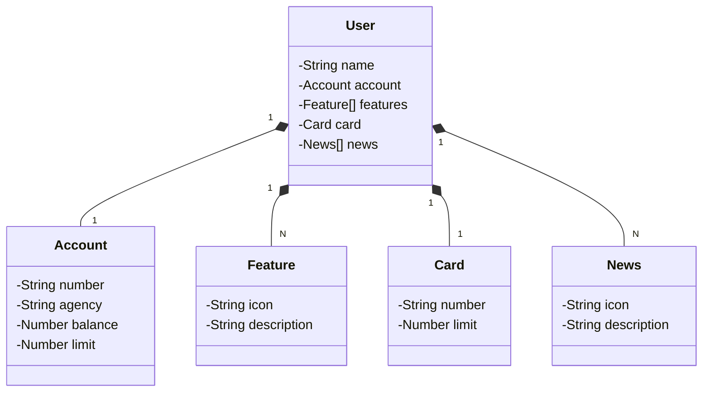

# 📌 Santander Dev Week 2023 – Projeto de Estudo

Este repositório contém uma **API REST em Java** desenvolvida como prática durante a Santander Dev Week 2023.  
O foco aqui é **aprender, experimentar e consolidar conceitos** de desenvolvimento back-end.  

---

## 🛠️ Tecnologias Utilizadas
- **Java 17** → versão LTS mais recente, aproveitando recursos modernos da linguagem  
- **Spring Boot 3** → autoconfiguração e alta produtividade no desenvolvimento  
- **Spring Data JPA** → acesso simplificado a dados relacionais  
- **OpenAPI (Swagger)** → documentação clara e interativa para os endpoints  
- **Railway** → deploy rápido na nuvem e provisionamento de banco de dados

---

## 🎨 Modelagem da API
O design do domínio foi abstraído no **Figma**:  
👉 [Link para o Figma](https://www.figma.com/file/0ZsjwjsYlYd3timxqMWlbj/SANTANDER---Projeto-Web%2FMobile?type=design&node-id=1421%3A432&mode=design&t=6dPQuerScEQH0zAn-1)

---

## 📊 Diagrama de Classes

---

## 📖 Observações
- Este projeto tem caráter **educacional** e foi criado **para estudo**.  
- Existe uma versão mais robusta, mantida pela **DIO**, com recursos adicionais como CRUD completo, uso de DTOs e documentação aprimorada.  

👉 Confira: [digitalinnovationone/santander-dev-week-2023-api](https://github.com/digitalinnovationone/santander-dev-week-2023-api)

---

## 🔮 Próximos Passos
No futuro, este projeto será **refinado e expandido**, incorporando:
- Melhorias na modelagem  
- Novos endpoints  
- Integração com banco real  
- Boas práticas avançadas com Spring  

---

📌 **Status atual:** 🚧 Projeto em estudo, aberto a melhorias.  
